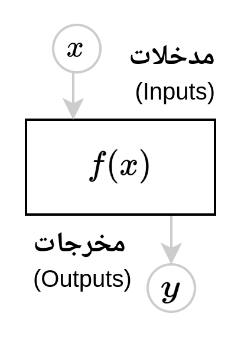
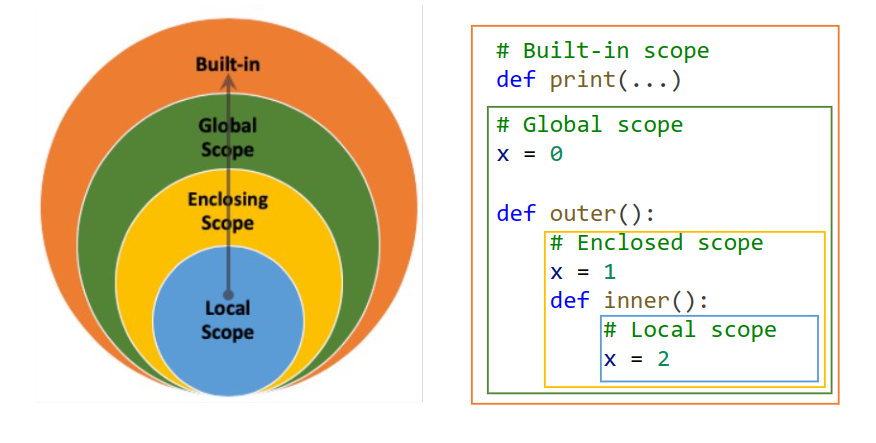

# الدالة

{width="33%"}

**الدالة** (Function) قطعة نص برمجيّ لها اسم، يتم استدعاؤها بمعطيات مختلفة بحسب معاملاته.
ويسمى **الإجراء** (Procedure) أو الروتين (Routine) أو البرنامج الفرعي (Sub-Program).

## تعدد المعطيات في استدعاء الإجراء

ونقول استدعي الدالة (Call) أو نفذه (Execute). ويسمى مكان القطعة التي قامت بالاستدعاء: **موقع الاستدعاء** (Call-site).

فقد يأخذ الإجراء أكثر من معطى:

- نحو: `round(x, n)` مثل: `round(10.259, 2)` ينتج: `10.26`.
- أو نحو: `pow(x, y)` لرفع العدد `x` إلى القوة `y`. مثل: `pow(2, 3)` ينتج: `8`.

وقد يأخذ معطىاً واحدًا لكنَّهُ يمثل مجموعة معطيات، لكونِه جَمعًا في نفسه (كالقائمة: `list`):

- نحو: `sum(numbers)` مثل: `sum([1, 2, 3, 4, 5])` ينتج: `15`.
- أو نحو: `max(numbers)` لأكبر عدد في القائمة. مثل: `max([1, 2, 30, 4, 5])` ينتج: `30`.

وقد يكون عدد معطياته لا محدودًا:

- نحو: `print(*values)`. فعلامة النجمة (`*`) تشير لقبول **عدد مطلق من العوامل**. مثل:

```{python}
name = "Adam"
age = 25
print("My name is", name, "and I'm", age, "years old")
```

فإن `print` قبلت خمسة عوامل:

1. النص: `"My name is"`
2. قيمة المتغير: `name`
3. النص: `"and I'm"`
4. قيمة المتغير: `age`
5. النص: `"years old"`

## طلب المساعدة

وقد عرفت أن **طلب التنفيذ** يكون بالقوسين بعد اسمه `()`، وتوضَع المعطيات فيهما.
ولدينا الإجراء `help(func)` يطلب مساعدة الإجراء المعيَّن، بلا أقواس، هكذا:

```{python}
help(sum)
```

## شكلان لاستدعاء الإجراء
 
وقد وضعت اللغات **الكائنية** (Object-oriented) مثل بايثون صياغة خاصَّةً: **للإجراء المسند إلى الكائن**.
وبذلك يتحصل لدينا طريقتان كلتاهما تؤديان نفس المعنى:

1. إسناد الإجراء للنوع: `list.append(xs, 25)`
2. إسناد الإجراء للكائن: `xs.append(25)`

ومثاله أيضًا في الإجراء `list.sort` للترتيب وكذلك في `list.append` للإضافة:

```{python}
xs = [20, 10, 30, 40]
ys = [20, 10, 30, 40]
```

```{python}
list.sort(xs)
ys.sort()
print(xs == ys)
```

```{python}
list.append(xs, 50)
ys.append(50)
print(xs == ys)
```

## نتيجة الإجراء

لابد للإجراء -حتى يكون نافعًا- أن يكون له أثر.
وإنما يحقق الإجراء تأثيرًا بإحدى طريقتين:

أحدها: **الرجوع** بنتيجة لموضِع الاستدعاء؛ وذلك بجملة الرجوع (`return`).
مثال ذلك:

```{python}
def pow(x, y):
    return x ** y
```

```{python}
y = pow(2, 3)
```

والأخرى: **التغيير** في مُعطىً قابل للتغيير (كالقائمة أو الملف).
مثال ذلك:

```{python}
def print_decorated(message: str, n: int):
    print("=" * n)
    print(message)
    print("=" * n)
```

```{python}
print_decorated("Salam alykom", 15)
```

والكائنات قد يحصل فيها إحدى الأمرين لغرض ما.

فالقائمة (`list`) هي مظنَّة التغيير.

ففي نحو: `sorted(xs)` فإن الإجراء يُنتِجُ نُسخةً معدَّلة، ولا يغير القائمة الأصلية؛ وذلك يتطلَّبُ مساحة إضافية في الذاكرة أثناء العمليَّة. وقد يكون هذا مرغوبًا في البرامج التي تحتاج لمتابعة التغييرات الحاصلة، حيث يتم الاحتفاظ بالنُّسَخ البينية.

```{python}
xs = [40, 20, 10, 30]
ys = sorted(xs)
print(xs, "لم يعمل الإجراء في القائمة نفسها")
print(ys, "هي قائمة جديدة")
```


وأما في نحو: `xs.sort()` فإن الطريقة (`.sort()`) تغيِّرُ القائمة المُسندَة؛ فلا تحتاجُ لنسخ القائمة في الذاكرة للتعديل عليها.

```{python}
xs = [20, 10, 30, 40]
xs.sort()
print(xs)
```


## تمرير المعطيات بالاسم

وقد تُعَيَّنُ المعطيات بأحد طريقتين:

1. **تعيين بالموضع**: نحو: `round(3.14159, 2)`
2. **تعيين بالاسم**: نحو: `round(number=3.14159, ndigits=2)` فلا يشترط فيه ترتيب المعطيات.

ويجوز استعمال الطريقتين معًا في نحو: `list.sort(numbers, reverse=True)` ويشترط فيه تقدم التعيين بالموضع ليكون في مكانه، ثم يتبعه التعيين بالاسم حيث لا يشترط الترتيب فيه.

وفي التعريف تكون المعطيات كثيرة في الإجراء على النحو التالي:

```{python}
def weather_condition(temperature, humidity, wind_speed):
    if temperature >= 30 and humidity >= 60 and wind_speed >= 10:
        return "Rainy"
    elif temperature >= 20 and humidity >= 50 and wind_speed >= 5:
        return "Cloudy"
    elif temperature >= 10 and humidity >= 30 and wind_speed >= 0:
        return "Sunny"
    return "Normal"
```

ويكون طلبها بالطريقتين كما تقدَّم، بالموضع أو بالاسم. ولاحظ أن التمرير بالاسم يجوز فيه تبديل الترتيب، وأما القيمة التي تمرر بالموضع فلا بد أن تكون في الموضع.

```{python}
cond = weather_condition(30, wind_speed=10, humidity=60)

if cond == "Rainy":
    print("Don't forget your umbrella!")
```

## المعطيات الجائزة

الأصل في المعطيات المعرَّفة الوجوب؛. فلو أهملت أحدها فإنك ستواجه بالخطأ:

```{python}
# | error: true
def weather_condition(temperature, humidity, wind_speed):
    pass

weather_condition(30)
```

تقول رسالة الخطأ (السطر الأخير) أن الإجراء يفتقد معطىيْن موضعيين إلزاميين، وهما: `humidity` و `wind_speed`.

فلو أردنا أن يكون عمل الإجراء بحسب أحد المعطيات بالتعيين، على نحو:

- لو عينت السلزيوس فالتحويل لفهرنهايت: `convert_temperature(celsius=32)`
- لو عينت الفهرنهايت فالتحويل لسلزيوس: `convert_temperature(fahrenheit=89.6)`

وإليك معادلة التحويل بين نوعيْ درجة الحرارة:

$$
F = \frac{9}{5} C + 32
$$

فأي معطى نعرفه بقيمة افتراضية فإن بايثون تعتبره اختياريًّا، ولو بالقيمة العدميَّة `None`. فنعرِّفُ المعطيات بقيَم عدميَّة، ونفحص وجودها بالشرط `is not None` لنُعمِلَها أو نهملها:

```{python}
def convert_temperature(celsius = None, fahrenheit = None):
    if celsius is not None:
        fahrenheit = (9 / 5) * celsius + 32
        return fahrenheit
    elif fahrenheit is not None:
        celsius = (fahrenheit - 32) * (5 / 9)
        return celsius
```

نتأكد:

```{python}
assert convert_temperature(celsius=32) == 89.6
assert convert_temperature(fahrenheit=89.6) == 32
```

## نطاق التسمية

ومن خصائصها أن المتغيرات في الداخل لا تظهر للخارج.

```{python}
def calculate_bmi(weight, height):
    bmi = weight / (height ** 2)
    return round(bmi, 2)
```

فنتوقع وقوع خطأ هنا لأن `bmi` غير معرفة إلا في نطاق الإجراء:

```{python}
#| error: true

print(bmi)
```

تقول رسالة الخطأ (السطر الأخير) أن المتغير `bmi` غير معرَّف. وهذا منطقي لأن النطاق الخارجي لا يعلم ما تكنه النطاقات الداخلية الخاصة بالإجراءات. وهو أمر مطلوب جدًّا ومرغوب في البرمجة. وذلك يعني أننا لن نتعب كثيرًا في اختيار الأسماء داخل كل إجراء، مخافة التعارض.

### معطيات غير مصرح بها

وعلى العكس فإن المعرَّفات الخارجة معروفة في الداخل؛ وذلك يعني أنها يمكن أن تعمل في الإجراء بشكل غير مباشر. أي أنها **معطيات غير مصرَّح بها** (هو: `max_length` في هذا المثال):

```{python}
max_length = 8

def check_password_strength(password):
    if len(password) > max_length:
        return "strong"
    elif len(password) > max_length // 2:
        return "medium"
    return "weak"
```

### مستويات نطاق التسمية



مستويات **النطاقات** (Scopes) من الداخل إلى الخارج:

- **النطاق المحلي** (Local Scope): المتغيرات المعرفة داخل إجراء.
- **النطاق المحيط** (Enclosing Scope): المتغيرات المعرفة في إجراء يتحوي ذلك الإجراء.
- **النطاق العام** (Global Scope): المتغيرات المعرفة خارج جميع الإجراءات.
- **النطاق المدمج** (Built-in Scope): الإجراءات المدمجة في بايثون مثل `print()`.

نصيحة: اجعل الاستعمال تاليًا لأخص نطاق؛ تَسْلَم. فهو كاستعمال الضمائر في اللغة: لا نحب أن تبعُد عما أُبدلت عنه إذ ذلك مظنَّة الإبهام.
لكن قد يكون من المعرَّفات ما هو ثابت ومعطىٌ به في كل مكان. فهو أشبه بالإعدادات أو الضبط للبرنامج كله. ومثل ذلك الأليق فيه أن يكون في نطاقٍ أعم.
